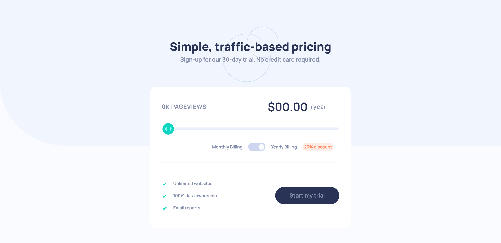

# Frontend Mentor - Interactive pricing component solution

<style>
  * {
    scroll-behavior:smooth;
    scroll-snap-align:center;
  }
</style>
This is a solution to the [Interactive pricing component challenge on Frontend Mentor](https://www.frontendmentor.io/challenges/interactive-pricing-component-t0m8PIyY8). Frontend Mentor challenges help you improve your coding skills by building realistic projects. 

## Table of contents

- [Overview](#overview)
  - [The challenge](#the-challenge)
  - [Screenshot](#screenshots)
  - [Links](#links)
- [My process](#my-process)
  - [Built with](#built-with)
  - [Tools](#tools)
  - [What I learned](#what-i-learned)
- [Author](#author)


## Overview

### The challenge

Users should be able to:

- View the optimal layout for the app depending on their device's screen size
- See hover states for all interactive elements on the page
- Use the slider and toggle to see prices for different page view numbers

<article id="screenshots">

  
  

</article>


### Links

- Solution URL: [Add solution URL here](https://your-solution-url.com)
- Live Site URL: [Add live site URL here](https://your-live-site-url.com)

### Built with

- Semantic HTML5 markup
- CSS custom properties
- Flexbox
- [SASS](https://sass-lang.com/) - For styles

### Tools Setup

- Initialize package.json file
```bash
  npm init --y
```

- Install SASS
```bash
  npm i sass
```
- Add custom watcher for sass
  - You can name output file  whatever you want
```json
  "scripts": {
    "watch" : "sass input.scss:output.css --watch"
  }
```


### What I Learned

- Dispatch fake click event for the accessibility
```js
toggleLabel.addEventListener("keydown", (e) => {
	if (!e.key.trim().length) {
		let event = new MouseEvent("click");
		test.dispatchEvent(event);
	}
});
```


## Author

- Frontend Mentor - [@GorkemEldeniz](https://www.frontendmentor.io/profile/GorkemEldeniz)

